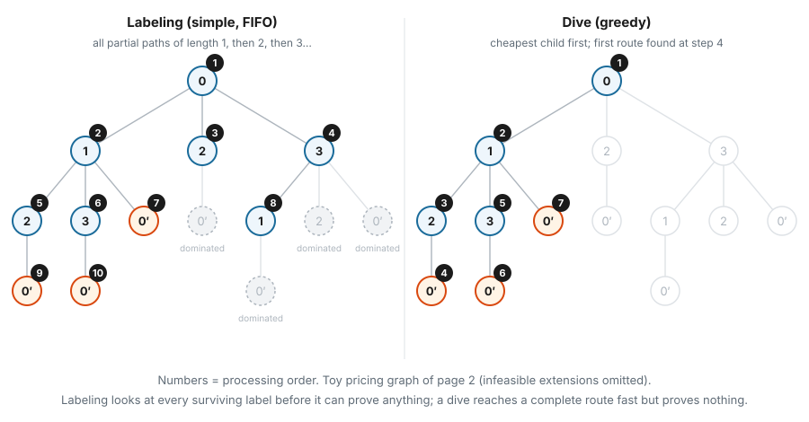
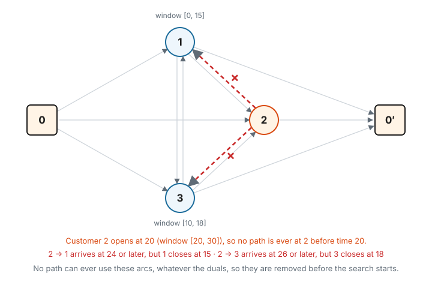

# 4. Algorithms and preprocessing

Pages 2 and 3 described *what* the search does: grow labels, discard infeasible and dominated ones. This page is
about *how* to run it:

- in what **order** labels are processed, and why `rcspp` offers several algorithms;
- which algorithms and settings are **exact** (they prove optimality) and which are **heuristics** (fast, no proof);
- what a solve's **status** tells you, and how to combine both kinds in column generation;
- how **preprocessing** shrinks the graph before the search starts;
- how the **label containers** speed up dominance checks.

All numbers on this page come from running the library on the pricing graph of page 2 (time windows, capacity 11,
all duals $\pi_i = 20$). Its two negative routes are 0→1→2→0′ (−16) and 0→1→3→0′ (−15).

---

## 4.1 Two families of algorithms



- **Labeling algorithms** keep many labels alive at once, compare labels at the same node, and discard the dominated
  ones. When they finish, they have *proved* that nothing better exists. These are `simple`, `pushing`, `pulling` and
  `astar`.
- **Dive algorithms** follow one partial path at a time, depth first: take the cheapest extension, keep going until
  the sink or a dead end, then back up and try the next option. They reach complete routes quickly, but they keep no
  labels per node and do no dominance, so they prove nothing. These are `greedy` and `tabu`.

---

## 4.2 The exact labeling algorithms

All four run the loop of page 2 (extend, check feasibility, check dominance) and return the same result when run
to completion. They differ only in **which label is processed next**.

| algorithm | processing order |
|---|---|
| `simple` (default) | one global queue, first in, first out (page 2, section 2.6) |
| `pushing` | node by node, in a fixed node order: take every waiting label at the current node and **push** it along the out-arcs, then move to the next node; repeat the sweep until nothing is left |
| `pulling` | node by node, in the same order: at the current node, **pull** the waiting labels of every predecessor along the in-arcs, then move on; repeat the sweep |
| `astar` | always the label with the smallest *current cost + lower bound on the cost still to come* |

On page 2's graph, all four return exactly the same two routes (−16 and −15) with status `complete`.

### Why the order matters

The order doesn't change the final answer, but it changes **how much work** is done. A label that is extended and
later dominated was wasted effort. Good orders create the "strong" labels early, so the weak ones are dominated
before they are extended.

- **Pushing and pulling** follow the node order computed during preprocessing (section 4.6): sources first, sinks
  last, and a node before the nodes it leads to whenever possible. On an **acyclic** graph in that order, every
  label reaching a node comes from nodes that are already finished, so a single sweep settles each node. This is
  common when time only moves forward, for example in time-expanded networks. On graphs with cycles, the sweep is
  repeated until no label is waiting.
- **`astar`** needs a lower bound $h(n)$ on the cost from node $n$ to the sink. It computes one with a backward
  Bellman–Ford pass on the cost alone, ignoring all other resources. The search is still complete, so the result
  is the same for any $h$; only the order changes. The lower bound matters most when the search is cut short
  (section 4.3), because then the most promising labels are the ones kept. If the reduced costs contain a
  **negative cycle**, no finite lower bound exists: $h$ is set to 0 and `astar` simply processes the cheapest label
  first.

:::{note}
In column generation, reduced costs almost always contain negative cycles. On page 2's graph, $1 \to 2 \to 1$ costs
$-32$. Even at page 1's final duals, $1 \to 2 \to 1$ costs $(4 - 11.5) + (4 - 12.5) = -16$. So in pricing, `astar`
usually runs without its heuristic. The same applies to the shortest-path preprocessing of section 4.6.
:::

Neither `pushing` nor `pulling` is **bidirectional** (a search from both the source and the sink that meets in the
middle). Resources already have the hooks such a search would need (`extend_back`, `can_be_merged`), but no algorithm
in the library uses them yet.

Which exact algorithm is fastest depends on the graph, so it is worth benchmarking on representative instances;
`examples/cpp/benchmark_main.cpp` shows how.

---

## 4.3 Trading exactness for speed

Exact labeling can be slow on large instances. These parameters (all in `AlgorithmParams`) cut the work down:

| parameter | what it does | still exact? |
|---|---|---|
| `stop_after_X_solutions = X` | return only the X cheapest routes | **yes**, the search still runs to the end, only the output is trimmed |
| … with `return_dominated_solutions = True` | record routes the moment they reach the sink, and **stop** after X of them | no |
| `num_labels_to_extend_by_node = k` | extend at most k labels per node; the others are set aside | no |
| `num_max_phases = m` | after the first pass, give the set-aside labels up to m − 1 more passes | no, unless the last pass finishes with nothing left aside |
| `timeout_s`, `max_iterations` | stop after a time or iteration budget | no |
| memory limits (`max_memory_gb`, `limit_to_available_ram`, …) | trim queues when memory runs low, stop when it runs out | no |

On the toy graph:

| settings | routes returned |
|---|---|
| `simple`, default | −16, −15 (optimal) |
| `simple`, `num_labels_to_extend_by_node = 1` | −15 only (missed the best route) |
| `simple`, `num_labels_to_extend_by_node = 1`, `num_max_phases = 3` | −16, −15 |

Truncating to k labels per node means different things in different algorithms. `pushing` and `pulling` keep the
**k cheapest** labels at a node, while `simple` extends the **first k** labels that reach it.

---

## 4.4 The dive algorithms

| algorithm | how it works |
|---|---|
| `greedy` | at every step, extend along all feasible arcs, sort the new labels by cost, continue with the cheapest; at a dead end, back up to the most recent alternative |
| `tabu` | repeated greedy dives; arcs used by recently found routes become *tabu* (forbidden) for `tabu_tenure` dives, which pushes later dives towards *different* routes. If every extension is tabu, the cheapest one is allowed anyway |

On the toy graph, `greedy` with `stop_after_X_solutions = 1` returns −16 after 4 steps (see the figure above). Here
that is the optimum, but only by luck. `tabu` with `max_iterations = 5` returns three distinct routes (−16, −15 and
−15 via 0→3→1→0′). That variety is useful when many columns per pricing round are wanted.

Always give a dive a stopping rule (`stop_after_X_solutions`, `max_iterations` or `timeout_s`). A dive never discards
a label by dominance, so on a large graph it could spend a very long time backtracking.

The C++ library has two more heuristics that Python doesn't expose. `ImprovingTabuSearch` repeats tabu dives,
each required to beat the best cost found so far. `DiversificationSearch` wraps another algorithm and re-solves
repeatedly, temporarily removing the arcs of the routes it found. It needs a finite `max_iterations`.

---

## 4.5 What a status proves

Every solve returns a `status`:

| status | meaning |
|---|---|
| `complete` | the search ran out of labels to process |
| `max_solutions` | stopped after `stop_after_X_solutions` routes |
| `max_phases` | `num_max_phases` passes done, labels still left |
| `timeout` | `timeout_s` reached |
| `interrupted` | stopped from outside (e.g. Ctrl+C in Python) |
| `memory_limit` | memory limit reached |

**Only an exact labeling algorithm, with no truncation, that returns `complete` proves that no better route
exists.** In column generation, that is the only situation in which "no negative route found" lets you stop.

:::{warning}
**Known issue (current code).** With `num_labels_to_extend_by_node` set, the labeling algorithms report `complete`
even though the labels set aside were never extended. On the toy graph with duals $\pi = (12, 12.5, 0)$, the exact
search finds a route with reduced cost −0.5. With `num_labels_to_extend_by_node = 1` it returns **no route, with
status `complete`**. Similarly, a dive that runs out of options returns `complete`, but a dive never proves
anything. Until this is fixed, the caller has to keep track of whether a solve was exact.
:::

### A pricing strategy for column generation

A common pattern is to use cheap heuristics while they still find improving columns, and exact pricing only to
confirm the end:

1. Price with a heuristic, such as `tabu`, `greedy`, or `simple` with a small `num_labels_to_extend_by_node`. Add
   whatever negative columns it finds.
2. When the heuristic finds nothing, price with an exact algorithm and default parameters.
3. Stop only when the **exact** pricing returns no negative route with status `complete`.

Returning several routes per round (the default for labeling algorithms, which return every non-dominated route at
the sink) also cuts the number of rounds, as page 1 showed.

---

## 4.6 Preprocessing

With `solve(preprocess=True)` (the default), three things happen before the search.

### Removing arcs that can never be used

For every node, the solver works out the states a path could be in right after arriving there, by extending the
starting state along each incoming arc. Then it checks every arc: if no such state can cross it feasibly, the arc is
removed. On page 2's graph this removes two arcs:



Page 2's label tree had rejected exactly these extensions (`0→2` could not continue to 1 or 3). Now they aren't even
tried.

- This check runs only when the graph has **changed** since the last solve, and removed arcs **stay removed**. That
  is fine in column generation, because it depends only on resources like time and load, never on the duals.
- It relies on the same property as dominance (page 3): a path's starting state must be its best possible state,
  and extension must keep the order.

### Removing arcs that are too expensive

When `upper_bound` is finite, the solver computes two shortest-path distances on the cost alone (Bellman–Ford, other
resources ignored): $\text{from}(u)$ from the source to every node, and $\text{to}(v)$ from every node to the sink.
An arc $u \to v$ with cost $c$ is removed for this solve if

$$
\text{from}(u) + c + \text{to}(v) \;>\; \text{upper bound} ,
$$

because even the cheapest path through that arc would be too expensive. For example, take the toy distances
**without** duals and ask for routes of length at most 24. Arc $1 \to 3$ is removed, since the cheapest route through
it costs $10 + 5 + 10 = 25 > 24$. Arc $1 \to 2$ stays ($10 + 4 + 10 = 24$).

- These arcs are **restored after the solve**, since they depend on the costs, and the costs change with the duals.
- This step is **skipped** when `upper_bound` is infinite (the default) or when the costs contain a negative cycle.
  As the note in section 4.2 explains, the second case is the usual one in column generation pricing. It is most
  useful for standalone RCSPPs with non-negative costs and a known budget.

### Ordering the nodes

The nodes are sorted: sources first, sinks last, and a node before the nodes it can reach but that cannot reach it
back. Ties are broken by distance from the source. `pushing` and `pulling` sweep the nodes in this order.

---

## 4.7 Label containers: faster dominance checks

Every new label is compared with the labels already at its node. With the default container, `LabelList`, that is a
check against **every** stored label, which becomes the bottleneck when nodes hold hundreds of labels.

`LabelBuckets` splits the labels at each node into **buckets** along one resource, typically time, and sorts each
bucket by another resource. With lower-is-better dominance, a label with time $t$ can only be dominated by labels
with time $\le t$, and can only dominate labels with time $\ge t$. So whole buckets can be skipped without comparing
anything.

Suppose node 2 holds 300 labels spread over times 20 to 30, in buckets of width 1. A new label with time 21.5 only
needs to be checked, for "am I dominated?", against the labels in the buckets up to 22. Most of the 300 are never
looked at.

```python
from rcspp.graph import BucketAlgorithmParams

bp = BucketAlgorithmParams()
bp.range_buckets = 1            # bucket WIDTH (an integer) along the bucket resource, not a count
bp.bucket_resource_index = 1    # resource 1 (time) defines the buckets
bp.sort_resource_index = 0      # sort each bucket by resource 0 (cost)
result = rg.solve(params=bp)
```

The result is the same as with `LabelList`; only the speed changes.

---

## 4.8 In code

```python
from rcspp.graph import AlgorithmParams

result = rg.solve(algorithm="simple")              # "simple", "pushing", "pulling", "astar", "greedy", "tabu"
print(result.status_string())                      # "complete", "timeout", "max_solutions", ...

p = AlgorithmParams()
p.stop_after_X_solutions = 10                      # exact: the 10 cheapest routes
result = rg.solve(upper_bound=-1e-9, params=p)

p = AlgorithmParams()
p.num_labels_to_extend_by_node = 5                 # heuristic: at most 5 labels extended per node
p.num_max_phases = 2
p.timeout_s = 1.0
result = rg.solve(upper_bound=-1e-9, params=p)

p = AlgorithmParams()
p.max_iterations = 50                              # tabu: 50 dives
p.tabu_tenure = 5
result = rg.solve(algorithm="tabu", upper_bound=-1e-9, params=p)

result = rg.solve(preprocess=False)                # skip all preprocessing
```

In C++ the algorithm is a template parameter, for example
`graph.solve<PushingDominanceAlgorithm>(upper_bound, params)`. See [Algorithms](../advanced/algorithms.md) for more
examples.

---

## Check yourself

1. `pushing` and `simple` always return the same routes when they complete. So why offer both?
2. You set `stop_after_X_solutions = 1` on `simple`. Is the returned route guaranteed to be the cheapest? What if you
   also set `return_dominated_solutions = True`?
3. Why does `astar` usually run without its heuristic in column generation pricing?
4. The feasibility preprocessing removed $2 \to 1$ permanently. Why is this safe in column generation, but the
   cost-based removal must be undone after each solve?
5. Column generation priced with `tabu` for 30 rounds, and `tabu` now finds no negative route. Can you stop?

### Answers

1. They process labels in different orders, which changes how many labels are created and extended before the
   dominated ones are discarded. The answer is the same; the running time is not.
2. Yes: without `return_dominated_solutions`, the labeling search still runs to completion and only the output is
   trimmed to the best route. With `return_dominated_solutions = True`, it stops at the first route reaching the
   sink, which need not be the cheapest.
3. The heuristic needs a finite lower bound on the remaining cost, and reduced costs usually contain negative
   cycles, so no finite bound exists. The algorithm then falls back to cheapest-label-first.
4. Whether a path can use $2 \to 1$ depends only on time windows, which never change. Whether an arc is too
   expensive depends on the reduced costs, which change with the duals every round.
5. No. `tabu` is a heuristic: finding nothing does not mean nothing exists. Run an exact algorithm with default
   parameters, and stop only if it returns no negative route with status `complete`.
