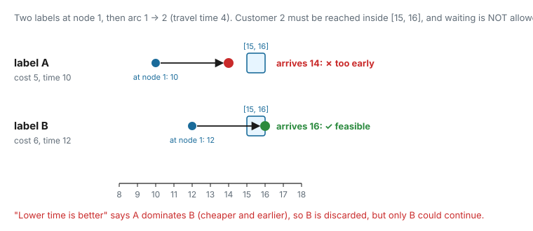
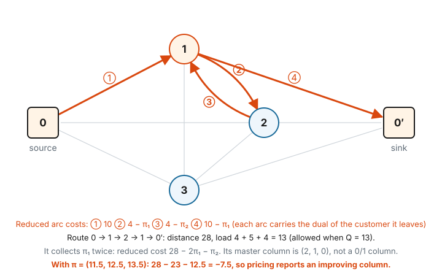

# 3. Dominance and elementarity

[Page 2](resources-and-labels.md) showed the solver discarding labels by **dominance**, and ended with a warning:
`0→3→2` was discarded in favour of `0→1→2` although they had visited different customers. This page answers two
questions:

- **When is it safe to discard a label?** What exactly does dominance promise, and how can a resource break that
  promise?
- **What about paths that visit a customer twice?** Why they matter for column generation, and the two standard
  ways to deal with them: *elementary* paths and *ng-paths*.

---

## 3.1 What dominance promises

Without dominance, the search would build one label per partial path, and the number of paths grows exponentially
(page 1, section 1.4). Dominance is what makes the search practical: it lets us throw away whole families of paths
at once, namely every continuation of a discarded label.

That is only acceptable if nothing good is lost. The promise is:

> Label $L_1$ **dominates** label $L_2$ (both at the same node) if **every** way to complete $L_2$ into a full path
> also completes $L_1$, and the result for $L_1$ is **at least as cheap**.

If that holds, discarding $L_2$ never loses the best path: whatever $L_2$ could have become, $L_1$ becomes something
at least as good. (With exact ties, one of the two is kept; you still get an optimal path, just not every optimal
path.)

The library cannot check "every way to complete" directly; there are too many. Instead it compares resources one by
one, using the dominance function of each (page 2, section 2.4): $L_1$ dominates $L_2$ if it is at least as good on
**every** resource. Whether this per-resource test really delivers the promise depends on how the resources are
defined.

---

## 3.2 When is a dominance rule safe?

Write $v_1 \preceq v_2$ for "value $v_1$ is at least as good as $v_2$" according to a resource's dominance function
(for `ValueDominanceFunction`, that is $v_1 \le v_2$). The per-resource test is safe when three conditions hold:

1. **Extension keeps the order.** If $v_1 \preceq v_2$, then after crossing the same arc, still
   $\text{ext}(v_1) \preceq \text{ext}(v_2)$. "Better now" stays "better later".
2. **Better values are never less feasible.** If $v_2$ is allowed at a node and $v_1 \preceq v_2$, then $v_1$ is
   allowed too.
3. **The rest of the path costs the same.** The cost added by the remaining arcs doesn't depend on the other
   resources. (True whenever the cost resource just adds up arc costs, as with reduced costs.)

Together these say: take any completion of $L_2$ and apply the same arcs to $L_1$. By (1) $L_1$ stays at least as
good on every resource at every step, by (2) it stays feasible whenever $L_2$ does, and by (3) its final cost is no
higher.

Checking the resources of page 2:

| resource | extension | order kept? | feasibility | better values never less feasible? |
|---|---|---|---|---|
| reduced cost | $c + \bar c_{ij}$ | ✓ adding the same number keeps $\le$ | none | ✓ |
| time | $\max(t + d_{ij}, a_j)$ | ✓ earlier stays earlier or equal (waiting can only erase the difference) | $t \le b_j$ | ✓ earlier is never too late |
| load | $\ell + q_j$ | ✓ | $0 \le \ell \le Q$ | ✓ loads never drop below 0 here |

All three pass, so the search of page 2 was exact, **for paths that may revisit customers**. We will see below why
that last part matters.

---

## 3.3 A rule that breaks: no waiting allowed

Suppose vehicles are **not** allowed to wait: a customer must be reached inside its window, early arrival included.
You could model this with `AdditionExtensionFunction` on time (no $\max$) and a per-node
`MinMaxFeasibilityFunction` $[a_j, b_j]$. The model itself is correct. But keeping `ValueDominanceFunction` on time
makes the search wrong:



Label A is cheaper and earlier, so "lower time is better" says A dominates B, and B is discarded. But A arrives at
customer 2 too early and can't wait, while B arrives exactly in time. The only feasible continuation is lost.

Condition 2 fails: time 10 is "better" than 12, but it leads to a value (14) that is *less* feasible than 16. With
no waiting, earlier is not always better.

The fixes all come back to the three conditions:

- allow waiting (`TimeWindowExtensionFunction`), so earlier really is better; or
- compare time with a rule that is safe for this model. For example, only let labels with **equal** time dominate
  each other. That needs a custom dominance function.

Note that `TrivialDominanceFunction` is **not** a fix: it ignores time entirely, which is even more aggressive.

:::{important}
A wrong dominance rule doesn't crash anything. The search just silently returns a path that isn't the best one,
or reports that no negative path exists when one does. In column generation this ends the loop too early, with a
wrong bound. Any new resource should be checked against the three conditions explicitly.
:::

---

## 3.4 Paths that visit a customer twice

So far every path was allowed to visit a customer more than once. Page 2 got away with this because time windows
and capacity happened to forbid every cycle. That is not always the case.

Take the page 1 instance and raise the capacity from 11 to **13** (demands stay 4, 5, 6). All three customers
together still don't fit ($15 > 13$), so the legal *routes* are exactly the same as on page 1. But now this path is
allowed:



$0 \to 1 \to 2 \to 1 \to 0'$ has load $4 + 5 + 4 = 13 \le 13$ and distance 28. In the master problem, its column
covers customer 1 **twice**: $a_{1p} = 2$, $a_{2p} = 1$, $a_{3p} = 0$.

### Why this is a problem

Such a column can never be part of a real plan: with $x_p = 1$, customer 1's constraint would read $2 = 1$. But the
**LP** can use it fractionally. Compare the master LP with and without these paths:

| allowed paths | LP optimum | LP solution |
|---|---|---|
| visit each customer at most once | **37.5** | $x_{12} = x_{13} = x_{23} = \tfrac12$ |
| revisits allowed | **35** | $x_{0\to1\to2\to1\to0} = \tfrac13$, $x_{13} = \tfrac13$, $x_{23} = \tfrac23$ |

Check the second solution: customer 1 is covered $2 \cdot \tfrac13 + \tfrac13 = 1$ time, customer 2
$\tfrac13 + \tfrac23 = 1$, customer 3 $\tfrac13 + \tfrac23 = 1$. The cost is $\tfrac{28 + 25 + 2 \cdot 26}{3} = 35$.

The bound drops from 37.5 to 35, **further from the true optimum of 44**, and it is a worse bound for no benefit,
because the extra column can never be used in a real plan. It also changes how column generation behaves. At page 1's
final duals $\pi = (11.5, 12.5, 13.5)$, pricing now reports

$$
\bar c = 28 - 2\pi_1 - \pi_2 = 28 - 23 - 12.5 = -7.5 ,
$$

so the loop does not stop where it should. It keeps adding columns like this one and converges to the weaker bound.

We ran the library's solver on exactly this graph. With revisits allowed it returns `0 1 2 1 0′` with reduced cost
$-7.5$. With either of the two fixes below, the best reduced cost it finds is 0, and column generation correctly
stops.

### Words for this

- An **elementary** path visits each node at most once.
- Pricing over **non-elementary** paths (revisits allowed) is a **relaxation**. It is easier to solve, but it gives a
  weaker LP bound.
- The repository's **Python VRP example** prices non-elementary paths. That is why `MasterProblem.add_paths` counts
  visits (`visit_counts`) to build its columns. On the Solomon instances in `instances/`, time windows forbid most
  cycles, so the loss is limited, but it is not zero.

---

## 3.5 Elementary paths with a "visited" set

To forbid revisits, add a resource that remembers **which customers the path has visited**: a set resource
(page 2, section 2.7).

| function | choice | meaning |
|---|---|---|
| extension | **union**, with arc $i \to j$ consuming $\{i\}$ | add the customer we just left |
| feasibility | **intersection, forbidden** with $\{j\}$ at node $j$ | we may not arrive at $j$ if $j$ is already in the set |
| dominance | **inclusion**: $S_1 \subseteq S_2$ | having visited fewer customers is better: you can still do more |
| cost | trivial | |

With this resource, the set stored in a label at node $j$ contains every customer visited *before* $j$. Arriving at
$j$ is refused if $j$ is already in it.

### It fixes page 2's warning

At node 2, page 2 compared these two labels (with visited sets added):

| label | reduced cost | time | load | visited before 2 |
|---|---|---|---|---|
| `0→1→2` | −6 | 20 | 9 | $\{1\}$ |
| `0→3→2` | −4 | 20 | 11 | $\{3\}$ |

$\{1\} \not\subseteq \{3\}$, so `0→1→2` **no longer dominates** `0→3→2`. That is correct: `0→3→2` may still visit
customer 1, and `0→1→2` may not.

### The price: much weaker dominance

Labels with different visited sets can rarely dominate each other, so many more labels survive. On the toy instance
at iteration 0 ($\pi_i = 20$, capacity 13), the solver returns:

| pricing | labels left at the sink |
|---|---|
| revisits allowed | 3 |
| elementary (visited set) | 6 |

Here the difference is small, but in general the number of labels can grow with the number of *subsets* of
customers, which is exponential. Elementary pricing on instances with long routes (many customers per vehicle) can
become far too slow. This is what ng-paths are for.

---

## 3.6 ng-paths: remember only nearby customers

The idea behind **ng-paths** is that a *good* route rarely comes back to a customer after driving far away, because
that is expensive. So there is no need to remember *every* visited customer. It is enough to remember recent visits
**in the neighbourhood** of where we are.

Each customer $i$ gets a **neighbourhood** $N(i)$, usually itself plus its $k$ nearest customers. A path carries a
**memory** set $M$:

- when the path visits $j$, the memory becomes $(M \cap N(j)) \cup \{j\}$: keep only what $j$ "cares about", then
  add $j$;
- the path may not go to a customer that is **in its memory**.

A customer is forgotten as soon as the path reaches a node whose neighbourhood doesn't contain it. From then on it may
be visited again. Such a return means a long detour, which will rarely look cheap.

### An example

With $N(1) = \{1, 2\}$, $N(2) = \{1, 2\}$ and $N(3) = \{1, 3\}$ (each customer and its nearest neighbour), follow the
path $0 \to 2 \to 1 \to 3$:

| after visiting | memory $M$ | forbidden next |
|---|---|---|
| 2 | $\{2\}$ | 2 |
| 1 | $(\{2\} \cap N(1)) \cup \{1\} = \{1, 2\}$ | 1, 2 |
| 3 | $(\{1, 2\} \cap N(3)) \cup \{3\} = \{1, 3\}$ | 1, 3 |

After reaching 3, customer 2 has been forgotten ($2 \notin N(3)$), so $\ldots \to 3 \to 2$ would be allowed. That path
is not elementary; ng-paths allow some cycles on purpose. But the short cycle $1 \to 2 \to 1$ from section 3.4 is
forbidden, because 1 is still in the memory when we are at 2.

### Where ng-paths sit

The allowed paths nest: every elementary path is an ng-path, and every ng-path is a (possibly non-elementary) path.
More allowed paths means more columns, so the LP bounds are ordered:

$$
\text{LP}_{\text{revisits allowed}} \;\le\; \text{LP}_{\text{ng-paths}} \;\le\; \text{LP}_{\text{elementary}}
$$

In the toy example: $35 \le 37.5 \le 37.5$. These neighbourhoods remove the only cycle that capacity allows, so
ng-paths reach the elementary bound here.

- **Bigger neighbourhoods** give a bound closer to elementary, but weaker dominance and a slower search.
- **Smaller neighbourhoods** give a faster search, but a weaker bound.

Dominance uses inclusion on the memory sets. Memories are much smaller than full visited sets, so labels dominate
each other far more often. In practice, neighbourhoods of a handful of nearest customers usually give most of the
elementary bound at a fraction of the cost. (The repository's C++ VRP example builds neighbourhoods of the 3 nearest
customers; see "In code" below.)

---

## 3.7 In code

### Available in C++

The elementary resource of section 3.5, as it was run to produce the numbers on this page:

```cpp
using R = RealResource;
using S = IntSetResource;                        // SetResource<int>
ResourceGraph<R, S> graph;
// ... resource 0: cost (real), resource 1: load (real), as on page 2 ...

// "visited before the current node": arriving at j is forbidden if j is in the set
std::map<size_t, std::set<int>> self{{1, {1}}, {2, {2}}, {3, {3}}};
graph.add_resource<S>(std::make_unique<UnionExtensionFunction<S>>(),
                      std::make_unique<IntersectionFeasibilityFunction<S>>(self, /*forbidden=*/true),
                      std::make_unique<TrivialCostFunction<S>>(),
                      std::make_unique<InclusionDominanceFunction<S>>());

// arc i -> j: the set resource consumes {i}  (empty set when i is the depot)
using Consumption = std::tuple<std::vector<std::tuple<double>>,             // real resources, in order
                               std::vector<std::tuple<std::set<int>>>>;     // set resources
std::set<int> left = (i == 0) ? std::set<int>{} : std::set<int>{int(i)};
graph.add_arc(Consumption{{{reduced_cost}, {demand_j}}, {{left}}}, i, j, base_cost, rows);
```

For **ng-paths**, replace the extension function and keep everything else:

```cpp
std::map<size_t, std::set<int>> neighbourhood{{1, {1, 2}}, {2, {1, 2}}, {3, {1, 3}}};
std::make_unique<NgPathExtensionFunction<S>>(neighbourhood)   // instead of UnionExtensionFunction<S>
```

`BitsetResource` (`UIntBitsetResource`) stores sets of node ids more compactly and is the usual choice for speed; the
numbers on this page were produced with `SetResource<int>`.

:::{note}
**How the library applies the ng rule.** On arc $i \to j$, `NgPathExtensionFunction` computes
$(S \cap N(i)) \cup \{i\}$, using the neighbourhood of the arc's **origin**, and the arc's consumption $\{i\}$.
So the set stored in a label at $j$ is the memory *after visiting $i$*, which is exactly the $M$ of section 3.6 one
step earlier. Checking "$j \notin S$" at $j$ is then the textbook rule.
:::

### Not yet available in Python

The Python package does **not** currently expose `NgPathExtensionFunction` or `IntersectionFeasibilityFunction`.
Set resources exist (`add_int_set_resource`, `add_bitset_resource`), with union, intersection and subtraction
extensions, size feasibility and inclusion dominance. But without a per-node "forbidden" check there is no way to
express "don't revisit $j$". **Elementary and ng-path pricing are therefore C++-only for now.**

The repository's examples reflect this. The Python VRP example prices non-elementary paths. The C++ VRP example
builds ng-neighbourhoods (`initialize_ng_neighborhoods(3)` in
[`examples/cpp/vrp/vrp.cpp`](https://github.com/lab-core/rcspp/blob/main/examples/cpp/vrp/vrp.cpp)), but its
visited-set and ng resources are commented out, so it prices non-elementary paths as well.

---

## Check yourself

1. Is `TimeWindowExtensionFunction` combined with `ValueDominanceFunction` on time a safe rule? Which of the three
   conditions of section 3.2 would a "no waiting" model break?
2. A battery resource starts full, decreases on every arc, and must stay $\ge 0$. Which dominance direction is safe:
   lower battery is better, or higher?
3. Why can a column with $a_{1p} = 2$ never appear in an integer solution of the set partitioning master, even though
   it can change the LP optimum?
4. With the neighbourhoods of section 3.6, is $0 \to 1 \to 3 \to 1$ an ng-path? And $0 \to 1 \to 2 \to 3 \to 1$?
5. Why must the LP bound with ng-paths lie between the non-elementary and the elementary bounds?

### Answers

1. Yes: with waiting, $\max(t + d, a)$ keeps the order and $t \le b$ is never harder for an earlier label, so all
   three conditions hold. Without waiting, the feasibility check becomes $a_j \le t \le b_j$. An earlier label can
   then be too early where a later one is fine, which breaks **condition 2**.
2. **Higher** is better: more charge left means every continuation that works for the other label also works for
   this one. So the dominance function must say "$v_1 \ge v_2$" (`ValueDominanceFunction` says $\le$, which would be
   wrong here). A simpler alternative is to track energy *used* instead: it increases, must stay $\le$ the battery
   capacity, and then "lower is better" (`ValueDominanceFunction`) is correct.
3. With $x_p \in \{0, 1\}$, using it gives customer 1 a coverage of at least 2, but the constraint requires exactly 1.
   Fractionally ($x_p = \tfrac13$) it contributes $\tfrac23$, which other columns can top up to 1, so the LP can use
   it.
4. $0 \to 1 \to 3 \to 1$: the memory after 1 is $\{1\}$; after 3 it is $(\{1\} \cap \{1, 3\}) \cup \{3\} = \{1, 3\}$, so
   returning to 1 is **forbidden**. $0 \to 1 \to 2 \to 3 \to 1$: after 1 $\{1\}$, after 2 $\{1, 2\}$, after 3
   $(\{1, 2\} \cap \{1, 3\}) \cup \{3\} = \{1, 3\}$: 1 is still remembered, so it is **forbidden** too. With these
   neighbourhoods customer 1 is in every neighbourhood, so it is never forgotten.
5. The sets of allowed paths nest (elementary ⊆ ng ⊆ all), so the master LPs have nested sets of columns. A
   minimisation over more columns can only give an equal or lower optimum.
