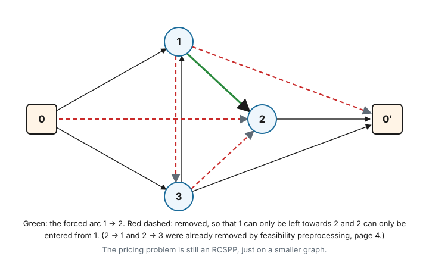
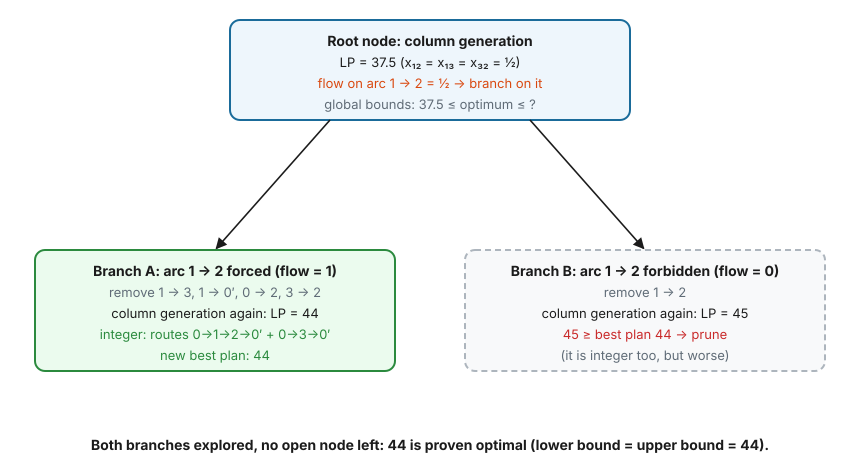

# 5. From LP to integer solutions

Column generation (page 1) solves the **LP relaxation** of the master problem. Real decisions need integers: a
vehicle drives a route or it doesn't. This page covers how to get from one to the other:

- what the LP value tells you (**bounds** and **gaps**);
- the quick way to get an integer plan, and why it can miss the optimum;
- **branch-and-price**: branching in a way that keeps the pricing problem an RCSPP;
- **cuts**: strengthening the LP without changing the pricing problem;
- which building blocks `rcspp` already provides, and which are left to you.

`rcspp` itself stops at pricing. Everything on this page happens around it, in your code. The library provides the
tools it needs, though, and knowing how they fit together is the point of this page.

We use the time-window instance of page 2 (capacity 11). Its legal routes and costs are:

| route | $p_1$: 0→1→0′ | $p_2$: 0→2→0′ | $p_3$: 0→3→0′ | $p_{12}$: 0→1→2→0′ | $p_{13}$: 0→1→3→0′ | $p_{31}$: 0→3→1→0′ | $p_{32}$: 0→3→2→0′ |
|---|---|---|---|---|---|---|---|
| cost | 20 | 20 | 20 | 24 | 25 | 25 | 26 |

With time windows, the order matters: customers 1 and 2 can only be served in the order 1 → 2, and customers 3 and 2
only in the order 3 → 2 (page 2). The costs are those of page 1, so the master LP is again worth **37.5**, with
$x_{12} = x_{13} = x_{32} = \tfrac12$. The best integer plan is again **44** ($p_{12} + p_3$).

---

## 5.1 Bounds and gaps

Two numbers bracket the optimal plan cost $z^*$:

- a **lower bound** $LB$: the master LP optimum. No plan is cheaper. (During column generation, the bound of page 1,
  section 1.11 gives one even before convergence.)
- an **upper bound** $UB$: the cost of any real plan you have found.

$$
LB \;\le\; z^* \;\le\; UB, \qquad \text{gap} = \frac{UB - LB}{UB}.
$$

In the example, $LB = 37.5$ and $UB = 44$ (once you have found that plan), a gap of $6.5 / 44 \approx 14.8\%$. Everything
below either **raises the lower bound** or **finds better plans**, until the gap is closed ($LB = UB$: proven
optimal) or small enough for your needs.

---

## 5.2 The quick way: solve the restricted master as an integer program

After column generation, solve the RMP once more **with integer variables**, using only the columns that were
generated. This is what the repository's VRP example does (`master.solve(relax=False)`).

It is fast and often good. In our example it returns 44, which is optimal. But it gives **no guarantee**, because the
best plan may need a column that pricing never produced.

### A counterexample

Four customers, capacity 10, demands $q = (3, 3, 5, 2)$, with these (rounded Euclidean) distances:

| | 0 | 1 | 2 | 3 | 4 |
|---|---|---|---|---|---|
| **0** | – | 8 | 5 | 6 | 7 |
| **1** | 8 | – | 4 | 10 | 15 |
| **2** | 5 | 4 | – | 6 | 12 |
| **3** | 6 | 10 | 6 | – | 10 |
| **4** | 7 | 15 | 12 | 10 | – |

Starting from the four single-customer routes and adding the best route each iteration, column generation adds
$\{1,2\}$ (cost 17), then $\{1,3,4\}$ (35), then $\{2,3,4\}$ (28), and stops with:

- **LP = 40**, using $\tfrac12$ of each of the three generated routes;
- **integer RMP = 43**: $\{1,2\} + \{3\} + \{4\}$, the best plan that can be built from the generated routes;
- **true optimum = 40**: $\{1,2\}$ (17) $+ \{3,4\}$ (23).

Route $\{3,4\}$ was never generated. At the final duals $\pi = (12, 5, 9, 14)$ its reduced cost is
$23 - 9 - 14 = 0$: not negative, so pricing had no reason to report it. The LP didn't need it (it had another way to
reach 40), but the integer plan did.

The restricted master IP is a good **heuristic** for the upper bound. To *prove* optimality, or to find plans it
misses, you need branching.

---

## 5.3 Branching, and why not on the route variables

Branch-and-bound splits a problem into subproblems that exclude the current fractional solution, and solves each
subproblem's LP. The obvious choice would be to pick a fractional $x_p$ and create two branches, $x_p = 1$ and
$x_p = 0$. In column generation this works badly:

- **$x_p = 0$ is hard to enforce in pricing.** Pricing would regenerate $p$ as soon as it looks attractive. Forbidding
  *one specific path* is not something resources can express easily, and the rule gets worse with every level of the
  tree.
- **The tree is unbalanced.** $x_p = 1$ fixes a whole route, while $x_p = 0$ removes one of billions of columns and
  barely changes the LP.

The standard fix is to branch on quantities that pricing *can* respect. The most common in routing is the arcs.

---

## 5.4 Branching on arcs

The **flow** on arc $a$ is how much the LP solution uses it:

$$
f_a = \sum_{p} (\text{number of times } p \text{ uses } a) \cdot x_p .
$$

In a real plan every $f_a$ is 0 or 1. At the root of our example:

| arc | 0→1 | 2→0′ | 0→3 | 3→0′ | 1→2 | 1→3 | 3→2 |
|---|---|---|---|---|---|---|---|
| flow | 1 | 1 | ½ | ½ | ½ | ½ | ½ |

($p_{12}$ and $p_{13}$ both use 0→1, each at ½. The other arcs follow the same way.)

Pick a fractional arc, here $1 \to 2$, and create two branches. **Both can be enforced by removing arcs**, so the
pricing problem stays an RCSPP on a smaller graph:

| branch | meaning | arcs removed from the pricing graph | columns removed from the RMP |
|---|---|---|---|
| **A**: $f_{12} = 1$ | some vehicle drives 1 → 2 | every other arc **leaving 1** (1→3, 1→0′) and every other arc **entering 2** (0→2, 3→2) | columns that use a removed arc |
| **B**: $f_{12} = 0$ | no vehicle drives 1 → 2 | 1 → 2 | columns that use 1 → 2 |

Branch A works because customer 1 is visited exactly once, so the vehicle must leave it by *some* arc. If 1 → 2 is
the only arc left, it will be used.



Running column generation again in each branch:

- **Branch A**: the remaining routes are $p_{12}$ and $p_3$ (customer 1 can no longer be alone, and 2 can only be
  reached from 1). LP = **44**, and the solution is integer: a real plan. New upper bound: 44.
- **Branch B**: without 1 → 2, customers 1 and 2 can't share a vehicle. LP = **45** (for example $p_{13} + p_2$). Since
  $45 \ge 44$, this branch cannot contain anything better, so it is **pruned**.



No branch is left open, so the lower bound (the smallest LP among open branches) has risen to meet the upper bound:
44 is **proven optimal**. On real instances the tree has many more levels, but every node works the same way.

### Practical points

- **Which arc?** A common default is the most fractional one (flow closest to ½). More expensive rules test several
  candidates first (*strong branching*).
- **When is a node "integer"?** If every arc flow is 0 or 1, the arcs describe complete routes, and you can read off
  a real plan of the same cost. That plan gives an upper bound.
- **Keep the RMP feasible.** Removing columns can leave a node's RMP infeasible. The usual fix is an expensive
  *artificial* column per customer (cost larger than any real plan). If the final LP of a node still uses one, that
  node has no feasible plan and is pruned.
- **Each node needs exact pricing** to produce a valid lower bound (page 4). The early lower bound of page 1,
  section 1.11 lets you stop a node's column generation as soon as that bound reaches the current upper bound.
- **Other branching rules** exist. *Ryan–Foster* branching ("customers $i$ and $j$ are served by the same vehicle, or
  not") is popular in set partitioning. Its "same vehicle" branch can be enforced by removing arcs, but its
  "different vehicles" branch needs an extra resource in pricing.

---

## 5.5 Cuts: raising the lower bound without branching

A **cut** is an inequality that every real plan satisfies but the current LP solution does not. Adding it to the
master raises the lower bound.

In our example, all three customers together weigh $4 + 5 + 6 = 15 > 11$, so **every plan needs at least 2 vehicles**:

$$
\sum_p x_p \;\ge\; 2 .
$$

The root LP solution uses $\tfrac12 + \tfrac12 + \tfrac12 = 1.5$ vehicles, which violates the cut. Adding it, the LP optimum
becomes **44**, with integer solution $p_{12} + p_3$. The gap is closed at the root, with no branching at all.

What does the cut do to pricing? It is a new master constraint with a dual $\sigma \ge 0$ (a "$\ge$" constraint, page 1,
section 1.6). Every route uses it exactly once, leaving the source, so it becomes **one more `Row` on every arc leaving
the source**:

$$
\bar c_{0j} = d_{0j} - \sigma .
$$

The pricing problem is **unchanged in structure**: same graph, same resources, only different arc costs. Here the new
duals are $\pi = (4, 4, 4)$ and $\sigma = 16$. For example
$\bar c_{p_{12}} = 24 - 4 - 4 - 16 = 0$ and $\bar c_{p_{13}} = 25 - 8 - 16 = 1$, so no route has negative reduced cost
and column generation stops at 44.

Two kinds of cuts:

- **Robust cuts** can be written in terms of arc flows, like the vehicle-count cut above, or *rounded capacity cuts*
  (at least $\lceil q(S)/Q \rceil$ vehicles must enter any customer set $S$). Their duals land on arcs as extra
  `Row`s, and pricing is unaffected. With `rcspp` this is just `add_rows_to_arc` with a new row index.
- **Non-robust cuts** (for example *subset-row cuts*) are defined on routes, not arcs. They are stronger but change
  the pricing problem: each needs an extra resource to track it.

Combining branching and cuts is called **branch-cut-and-price**, the state of the art for vehicle routing.

---

## 5.6 What `rcspp` provides, and what it doesn't

| need | in `rcspp` |
|---|---|
| Put master coefficients, including cuts, on arcs | `rows=` in `add_arc`, `add_rows_to_arc`, `add_rows` |
| Reduced costs from duals | `update_reduced_costs(duals)` |
| Exact and heuristic pricing, status | `solve(...)`, page 4 |
| Arc flows of an LP solution | `solution.path_arc_ids` of each column, weighted by its $x_p$ |
| Branch by removing arcs, and undo | `remove_arcs`, `restore_arcs`, `remove_arcs_if`, `restore_arcs_if` |
| An independent copy of the graph per node | `clone()` (a full copy: prefer remove/restore when you can) |
| Keep columns across nodes, excluding those that break a branch | `PricingPool` and `pool.new_filter(forbidden_arc_ids=[...])` |
| Master LP, branch-and-bound tree, branching rules, cut separation | **not provided**: your code, with an LP solver |

That last row is where most of the work of a "large-problem" layer would go. Here is a sketch of processing one
branch-and-price node with the existing API. `master`, `node`, `arc_flows` and `most_fractional` stand for your own
code; everything called on `rg`, `pool` and `columns` is `rcspp`:

```python
def process_node(rg, pool, node, master, upper_bound):
    removed = rg.remove_arcs(node.forbidden_arc_ids)          # enforce this node's branching decisions
    columns = pool.new_filter(forbidden_arc_ids=node.forbidden_arc_ids)
    try:
        while True:                                            # column generation at this node
            lp = master.solve_lp(columns)                      # returns x, duals, objective
            rg.update_reduced_costs(lp.duals)
            result = rg.solve(upper_bound=-1e-9)               # exact pricing (page 4)
            if not result.solutions:
                break                                          # LP of this node is solved
            columns.add_columns(result.solutions)
        if lp.objective >= upper_bound:
            return "pruned", None
        flows = arc_flows(lp.x, columns)                       # sum x_p over path_arc_ids
        fractional = [a for a, f in flows.items() if 1e-6 < f < 1 - 1e-6]
        if not fractional:
            return "integer", lp                               # new upper bound
        return "branch", most_fractional(fractional, flows)
    finally:
        rg.restore_arcs(removed)                               # leave the graph as we found it
```

---

## Check yourself

1. After column generation the LP is 37.5 and the restricted master IP returns a plan of cost 44. Without any more
   work, what do you know about the optimum?
2. In the counterexample of section 5.2, why did pricing never return route $\{3, 4\}$, even though it is in the
   optimal plan?
3. Why is forbidding arc $1 \to 2$ easy to enforce in pricing, but forbidding the route 0→1→2→0′ is not?
4. In branch A, why is it enough to remove the other arcs leaving 1 and the other arcs entering 2?
5. How does the vehicle-count cut $\sum_p x_p \ge 2$ appear in the pricing graph, and why doesn't it make pricing harder?

### Answers

1. $37.5 \le z^* \le 44$. The 44 plan may or may not be optimal: the gap is 14.8% until something proves more.
2. Its reduced cost at the final duals was exactly 0. Pricing only returns routes with negative reduced cost, and the
   LP could reach its optimum (40) without it.
3. An arc is part of the graph, so removing it simply removes every path through it. A single route is a whole
   sequence of arcs; forbidding just that sequence, while allowing each of its arcs in other routes, needs extra
   information in the labels.
4. Customer 1 is left exactly once and customer 2 is entered exactly once (each is visited exactly once). If $1 \to 2$
   is the only way out of 1 and the only way into 2, it must be used.
5. As a `Row` on every arc leaving the source, whose dual $\sigma$ is subtracted from those arc costs. The graph and the
   resources don't change, so the pricing problem is exactly as hard as before.
