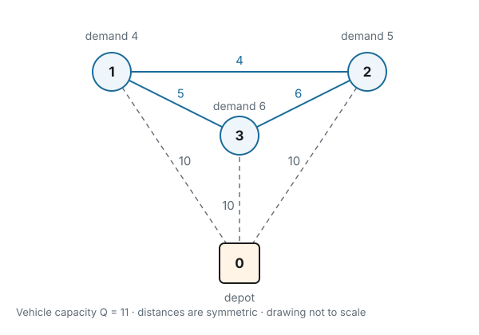
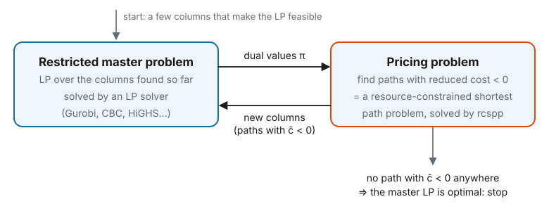
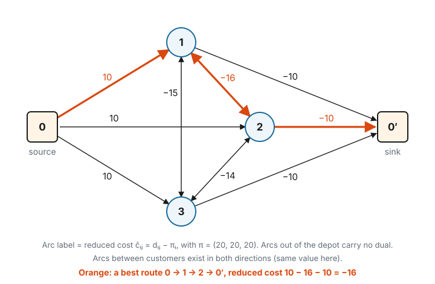

# 1. Master problem, pricing and duals

## What problem does `rcspp` solve?

The **resource-constrained shortest path problem** (RCSPP) is: *find the cheapest path from a source to a sink
in a directed graph, where every arc also consumes some **resources** (time, load, battery, working hours…),
and the path is only allowed if those resources stay within limits along the way.*

It shows up in two ways:

1. **On its own.** For example: the fastest route for an electric vehicle that must not run out of battery; the
   cheapest network path whose total delay stays under a limit; the shortest itinerary that respects opening
   hours. Here you build the graph once and call `solve()`.
2. **Inside a larger optimisation method called column generation.** This is by far the most common use, and it
   explains most of the library's design: why arcs carry `Row`s, why there is `update_reduced_costs`, and why
   `solve()` can return many solutions at once.

This page explains the second use from the ground up. By the end you should be able to:

- recognise problems of the form "choose a combination of paths" and write them as a *master problem*;
- explain what the dual values of that problem mean;
- compute the *reduced cost* of a path and say why a negative one is interesting;
- run column generation by hand on a tiny example;
- see why "find the path with the most negative reduced cost" is an RCSPP.

No prior knowledge of column generation is assumed. It helps to know what a linear program (LP) is, and that an
LP solver can return a *dual value* for each constraint. Section 1.6 explains what those values mean.

---

## 1.1 The pattern: choosing a combination of paths

Many large planning problems share the same structure:

- The decision is to pick a **set of objects**: vehicle routes, crew schedules, employee rosters, flows…
- Each object is a **path in some graph**, and must follow its **own rules** (capacity, maximum working time,
  rest periods…). These rules only look at *that one* path.
- The objects interact only through a few **linking constraints**: "every customer is visited once", "every
  flight has a crew", "at least 5 nurses are on duty at 8 am".

| problem | one path is… | graph nodes | rules for one path (resources) | linking constraints |
|---|---|---|---|---|
| Vehicle routing | a vehicle's route | depot, customers | load ≤ capacity, time windows | each customer visited exactly once |
| Crew scheduling | one crew's sequence of flights | flights over time | duty length, rest, return to base | each flight gets exactly one crew |
| Personnel rostering | one employee's schedule | (day, shift) pairs | max consecutive days, minimum rest | enough staff in each period |
| Network routing | one commodity's path | network nodes | hop count, delay | total flow on each link ≤ its capacity |

All of these fit the same model. Give every possible path $p$ a variable $x_p$ (how many times we use it, often
0 or 1), a cost $c_p$, and a coefficient $a_{ip}$ for how much it contributes to linking constraint $i$:

$$
\begin{aligned}
\min \quad & \sum_{p} c_p \, x_p \\
\text{s.t.} \quad & \sum_{p} a_{ip} \, x_p \;\;(=,\ \ge \text{ or } \le)\;\; b_i
  && \text{for every linking constraint } i \\
& x_p \in \{0, 1, 2, \ldots\} && \text{for every allowed path } p
\end{aligned}
$$

This is the **master problem**. Each path is one **column** of the constraint matrix: its cost on top, then its
coefficients $a_{ip}$. The trouble is that there are astronomically many possible paths. The rest of this page
shows how to solve the master problem anyway, and why doing so requires an RCSPP solver.

We use **vehicle routing** as the running example because it is the easiest to picture. Everything carries over
to the other rows of the table.

---

## 1.2 A tiny example

One depot (node `0`) and three customers:

| | depot 0 | customer 1 | customer 2 | customer 3 |
|---|---|---|---|---|
| **depot 0** | – | 10 | 10 | 10 |
| **customer 1** | 10 | – | 4 | 5 |
| **customer 2** | 10 | 4 | – | 6 |
| **customer 3** | 10 | 5 | 6 | – |

- We write $d_{ij}$ for the distance from node $i$ to node $j$ (the table above), e.g. $d_{01} = 10$, $d_{12} = 4$.
- Customer demands: $q_1 = 4$, $q_2 = 5$, $q_3 = 6$.
- Every vehicle has capacity $Q = 11$, starts at the depot and returns to it.
- There are as many vehicles as we like, and they cost nothing beyond the distance driven.
- **Goal:** visit every customer exactly once while minimising the total distance.

Look at the numbers before reading on. The customers are close to each other and far from the depot, so
serving two customers with one vehicle saves a lot of driving. But all three together weigh $4 + 5 + 6 = 15 > 11$,
so no single vehicle can serve everyone.

---

## 1.3 Paths as columns

A **route** here is a path depot → some customers → depot that respects the rules for one vehicle (only
capacity in this example). Every legal route:

| path $p$ | visits | load | cost $c_p$ |
|---|---|---|---|
| $p_1$ | 0 → 1 → 0 | 4 | 10 + 10 = **20** |
| $p_2$ | 0 → 2 → 0 | 5 | **20** |
| $p_3$ | 0 → 3 → 0 | 6 | **20** |
| $p_{12}$ | 0 → 1 → 2 → 0 | 9 | 10 + 4 + 10 = **24** |
| $p_{13}$ | 0 → 1 → 3 → 0 | 10 | 10 + 5 + 10 = **25** |
| $p_{23}$ | 0 → 2 → 3 → 0 | 11 | 10 + 6 + 10 = **26** |
| ~~0 → 1 → 2 → 3 → 0~~ | | 15 | not allowed: load > 11 |

Distances are symmetric, so 0 → 2 → 1 → 0 costs the same as 0 → 1 → 2 → 0. We keep one order per set of
customers.

Written as columns, with $a_{ip} = 1$ if path $p$ visits customer $i$:

| | $p_1$ | $p_2$ | $p_3$ | $p_{12}$ | $p_{13}$ | $p_{23}$ |
|---|---|---|---|---|---|---|
| **cost $c_p$** | 20 | 20 | 20 | 24 | 25 | 26 |
| customer 1 | 1 | 0 | 0 | 1 | 1 | 0 |
| customer 2 | 0 | 1 | 0 | 1 | 0 | 1 |
| customer 3 | 0 | 0 | 1 | 0 | 1 | 1 |

---

## 1.4 The master problem of the example

The linking constraints are "each customer is visited exactly once", so all of them are equalities with right-hand
side 1. This special case is called **set partitioning**:

$$
\begin{aligned}
\min \quad & 20x_1 + 20x_2 + 20x_3 + 24x_{12} + 25x_{13} + 26x_{23} \\
\text{s.t.} \quad & x_1 + x_{12} + x_{13} = 1 && \text{(customer 1)} \\
& x_2 + x_{12} + x_{23} = 1 && \text{(customer 2)} \\
& x_3 + x_{13} + x_{23} = 1 && \text{(customer 3)} \\
& x_p \in \{0, 1\}
\end{aligned}
$$

It is small enough to check every integer solution by hand:

| chosen paths | total |
|---|---|
| $p_1 + p_2 + p_3$ | 60 |
| $p_{12} + p_3$ | 24 + 20 = **44** ← best |
| $p_{13} + p_2$ | 25 + 20 = 45 |
| $p_{23} + p_1$ | 26 + 20 = 46 |

The best plan uses one vehicle for customers 1 and 2 and another for customer 3, for a total of **44**.

### Why this model is attractive

All the complicated rules (capacity, time windows, how vehicles move) are hidden inside one question: *is $p$ an
allowed path?* The master problem never sees a capacity or a clock. It only sees the linking constraints.

### Why we can't simply list every path

The number of paths explodes. Ignoring capacity, the number of routes that visit each of $n$ customers at most
once is $\sum_{k=1}^{n} \frac{n!}{(n-k)!}$:

| customers $n$ | possible routes |
|---|---|
| 3 | 15 |
| 5 | 325 |
| 10 | 9,864,100 |
| 25 | $\approx 4.2 \times 10^{25}$ |
| 100 | $\approx 2.5 \times 10^{158}$ |

The rules for each path remove many of these, but the count still grows exponentially. The same happens for crew
schedules or rosters. **Column generation solves the master problem while only ever writing down a tiny fraction
of its columns.**

---

## 1.5 Relax to an LP first

Column generation works on the **LP relaxation**: the integrality requirement is replaced by $x_p \ge 0$. (In
set partitioning, $x_p \le 1$ then follows automatically.)

Why relax?

1. LPs are fast to solve; integer programs are not.
2. The LP optimum is a **lower bound** on the best integer solution, because the LP allows everything the
   integer problem allows, and more.
3. LPs have **dual values**, and those are what guides the search for new paths.

In the example, the LP optimum is

$$
x_{12} = x_{13} = x_{23} = \tfrac{1}{2}, \qquad \text{cost} = \tfrac{24 + 25 + 26}{2} = 37.5 .
$$

Read it as "half a vehicle does 1–2, half does 1–3, half does 2–3". Each customer is covered by two halves, and
$\tfrac12 + \tfrac12 = 1$. This isn't a real plan, but it proves that **no plan can cost less than 37.5**. The best
real plan costs 44, so the **integrality gap** is $44 - 37.5 = 6.5$. How to get integer solutions is the subject of
page 5; for now we focus on solving the LP.

---

## 1.6 Duals: a price for each linking constraint

When an LP solver returns an optimal solution, it can also return one **dual value** $\pi_i$ per constraint. The
simplest way to think about $\pi_i$ is as a **price**: *how much the optimal cost would change if the right-hand
side $b_i$ grew by one unit*. This holds exactly when the optimum is not degenerate; in general, "price" is the
right intuition.

The duals themselves solve another LP, the **dual problem**. For our master problem it reads:

$$
\begin{aligned}
\max \quad & \sum_{i} b_i \, \pi_i \\
\text{s.t.} \quad & \sum_{i} a_{ip} \, \pi_i \le c_p && \text{for every path } p
\end{aligned}
$$

In words: *no path may be "worth" more, at these prices, than it costs.* The sign of each $\pi_i$ depends on the
type of its constraint (for a minimisation master):

| linking constraint | sign of $\pi_i$ | example |
|---|---|---|
| $\sum_p a_{ip} x_p = b_i$ | any sign | visit each customer exactly once |
| $\sum_p a_{ip} x_p \ge b_i$ | $\pi_i \ge 0$ | at least 5 nurses on duty: covering has value |
| $\sum_p a_{ip} x_p \le b_i$ | $\pi_i \le 0$ | link capacity: using it has a cost |

For the example (all $b_i = 1$), the dual is:

$$
\begin{aligned}
\max \quad & \pi_1 + \pi_2 + \pi_3 \\
\text{s.t.} \quad & \pi_1 \le 20, \quad \pi_2 \le 20, \quad \pi_3 \le 20 && (p_1, p_2, p_3) \\
& \pi_1 + \pi_2 \le 24 && (p_{12}) \\
& \pi_1 + \pi_3 \le 25 && (p_{13}) \\
& \pi_2 + \pi_3 \le 26 && (p_{23})
\end{aligned}
$$

Adding the three pair constraints gives $2(\pi_1 + \pi_2 + \pi_3) \le 75$, so the dual value is at most 37.5.
Making all three pair constraints tight gives $\pi = (11.5,\ 12.5,\ 13.5)$. That respects the other constraints and
reaches 37.5, exactly the LP optimum of the master problem. The fact that the two optima are equal is called
**strong duality**.

---

## 1.7 Reduced cost

The **reduced cost** of a path compares what it costs with what it is worth at the current prices:

$$
\boxed{\;\bar c_p \;=\; c_p \;-\; \sum_{i} a_{ip}\, \pi_i\;}
$$

In the example, $a_{ip}$ is 1 for the customers on the path, so $\bar c_p$ is simply *the path's cost minus the
prices of the customers it visits*.

Three facts from LP theory make this the central quantity:

- **Optimality test.** If the duals come from an optimal LP solution and $\bar c_p \ge 0$ for *every* path, that
  solution is optimal. (LP solvers use this very test internally; we only use its conclusion.)
- **Improving columns.** A path with $\bar c_p < 0$ is worth more than it costs at current prices. Adding it to
  the LP can lower the optimal cost. Note that $\bar c_p < 0$ means exactly that the dual constraint of $p$ is
  violated.
- **Paths in use cost nothing extra.** If $x_p > 0$ in the optimal solution then $\bar c_p = 0$. This is called
  *complementary slackness*, and it is a handy check on any dual values you receive.

---

## 1.8 Column generation

We can't write down every column, but we only need two things:

- a small LP with the columns found so far, called the **restricted master problem** (RMP);
- an answer to one question: **"is there any path, among all allowed paths, with negative reduced cost?"**

We answer that question by *solving an optimisation problem*, not by listing paths. This is the **pricing
problem**:

$$
\min_{p \text{ allowed path}} \ \bar c_p \;=\; \min_{p} \Big( c_p - \sum_{i} a_{ip}\, \pi_i \Big)
$$

The loop:

1. **Start** the RMP with a few columns that make it feasible. In routing, the usual choice is one route per
   customer, depot → $i$ → depot. Another generic option is "artificial" columns with a very high cost.
2. **Solve the RMP LP** and read the duals $\pi$.
3. **Solve the pricing problem** with those $\pi$.
4. If pricing finds paths with $\bar c_p < 0$, add them to the RMP and go back to step 2.
5. Otherwise **stop**. No allowed path has negative reduced cost, so by the optimality test the RMP solution is
   optimal for the *full* master LP, even though most of its columns were never written down.

:::{important}
Step 5's conclusion is only valid if pricing is **exact**, meaning it truly found the minimum over *all*
allowed paths. A heuristic pricing method (such as the library's `greedy` or `tabu` algorithms) is fine for
quickly finding *some* improving paths. But to conclude "none exist", at least the last pricing round must be
exact. See page 4.
:::

---

## 1.9 Why pricing is an RCSPP

How can you minimise $\bar c_p$ over billions of paths without listing them? It works when both the cost and the
coefficients of a path are **sums over its arcs**:

$$
c_p = \sum_{a \in p} c_a, \qquad a_{ip} = \sum_{a \in p} a_{ia}.
$$

Then the reduced cost is also a sum over arcs:

$$
\bar c_p = \sum_{a \in p} \Big( c_a - \sum_i a_{ia}\, \pi_i \Big) = \sum_{a \in p} \bar c_a .
$$

So **pricing is a shortest path problem with reduced arc costs $\bar c_a$**, restricted to *allowed* paths.
"Allowed" means the path's own rules hold, and those rules are the **resources**. Hence: pricing is a
resource-constrained shortest path problem.

This arc-by-arc bookkeeping is exactly what `rcspp` stores. Each arc carries a list of `Row(index, coefficient)`,
the $a_{ia}$ values, and `update_reduced_costs(duals)` computes $\bar c_a = c_a - \sum_i a_{ia}\pi_i$ for every arc.
The library doesn't know what the rows mean: that is up to the model.

| problem | where the linking rows go |
|---|---|
| Vehicle routing | row "customer $i$" on each arc leaving (or entering) customer $i$ |
| Crew scheduling | row "flight $f$" on each arc into flight $f$ |
| Personnel rostering | row "period $t$" on each arc that works a shift covering $t$ |
| Network routing | row "capacity of link $e$" on arc $e$, with the commodity's demand as coefficient |
| Fleet-size limit (any problem) | row "number of vehicles" on the arcs leaving the source |

### Back to the example

Split the depot in two, a **source** $0$ and a **sink** $0'$, so that a route is simply a path from source to sink.
The base cost of arc $i \to j$ is its distance: $c_{ij} = d_{ij}$. Put the dual of customer $i$ on the arcs
*leaving* $i$ (as the repository's VRP example does):

$$
\bar c_{ij} = d_{ij} - \pi_i \quad \text{if } i \text{ is a customer}, \qquad
\bar c_{0j} = d_{0j} \quad \text{(the depot has no dual)}.
$$

Check on one route:

$$
\bar c_{01} + \bar c_{12} + \bar c_{20'}
= 10 + (4 - \pi_1) + (10 - \pi_2)
= 24 - \pi_1 - \pi_2 = \bar c_{p_{12}} .
$$

Here is the pricing graph at the first iteration, where every $\pi_i = 20$:

### Why not an ordinary shortest path algorithm?

1. **Negative arcs.** Many reduced arc costs are negative, so Dijkstra's algorithm is ruled out.
2. **Negative cycles.** $1 \to 2 \to 1$ costs $-16 - 16 = -32$ per loop. Without extra rules, the "cheapest
   path" would loop forever.
3. **The past matters.** Whether a path may continue from node 2 depends on what it has *accumulated so far*.
   Arriving via $0 \to 1 \to 2$ means carrying load 9; arriving directly means carrying 5. These are different
   situations at the same node, so one distance label per node (as in Dijkstra) is not enough.

Resources handle point 3 and, here, point 2 as well: $0 \to 1 \to 2 \to 1$ would carry $4 + 5 + 4 = 13 > 11$, so it
is not allowed. Page 2 shows how `rcspp` represents resources, and page 3 covers cycles in general.

---

## 1.10 Running the loop by hand

Here is column generation on the example, **adding only the single best path per iteration** so that every step
is visible. The dual values are those returned by an actual LP solver (HiGHS).

### Iteration 0: RMP = $\{p_1, p_2, p_3\}$

- Each customer is covered by only one column, so the LP has no choice: $x_1 = x_2 = x_3 = 1$, cost **60**.
- Duals: $\pi = (20, 20, 20)$. Complementary slackness confirms it: $x_i > 0$ forces $\bar c_{p_i} = 20 - \pi_i = 0$.
  Each customer is "worth" exactly its own round trip.
- Pricing:

  | path | $c_p$ | $-\sum \pi_i$ | $\bar c_p$ |
  |---|---|---|---|
  | $p_{12}$ | 24 | $-40$ | **−16** ← best |
  | $p_{13}$ | 25 | $-40$ | −15 |
  | $p_{23}$ | 26 | $-40$ | −14 |
  | $p_1, p_2, p_3$ | 20 | $-20$ | 0 (in use) |

- Add $p_{12}$.

### Iteration 1: RMP = $\{p_1, p_2, p_3, p_{12}\}$

- LP: $x_{12} = 1$, $x_3 = 1$, cost **44**.
- Duals: $\pi = (20, 4, 20)$. Check: $\bar c_{p_{12}} = 24 - 20 - 4 = 0$ and $\bar c_{p_3} = 20 - 20 = 0$.
- Pricing: $\bar c_{p_{13}} = 25 - 40 = $ **−15** ← best, $\bar c_{p_{23}} = 26 - 24 = +2$,
  $\bar c_{p_2} = 20 - 4 = +16$.
- Add $p_{13}$.

### Iteration 2: RMP = $\{p_1, p_2, p_3, p_{12}, p_{13}\}$

- LP: still $x_{12} = x_3 = 1$, cost **44**. We added a column and nothing improved!
- Duals: $\pi = (4, 20, 20)$.
- Pricing: $\bar c_{p_{23}} = 26 - 40 = $ **−14** ← best, $\bar c_{p_{13}} = 25 - 24 = +1$.
- Add $p_{23}$.

### Iteration 3: RMP = all six paths

- LP: $x_{12} = x_{13} = x_{23} = \tfrac12$, cost **37.5**, $\pi = (11.5, 12.5, 13.5)$.
- Pricing: $\bar c_{p_1} = 8.5$, $\bar c_{p_2} = 7.5$, $\bar c_{p_3} = 6.5$, and the three pairs have 0.
- **No negative reduced cost. Stop.** The master LP optimum is 37.5.

### Summary

| iteration | columns in RMP | RMP LP value | best $\bar c_p$ | $\pi$ |
|---|---|---|---|---|
| 0 | 3 | 60 | −16 | (20, 20, 20) |
| 1 | 4 | 44 | −15 | (20, 4, 20) |
| 2 | 5 | 44 | −14 | (4, 20, 20) |
| 3 | 6 | **37.5** | 0 | (11.5, 12.5, 13.5) |

### What to notice

- **The RMP value never goes up.** Adding a column only enlarges the feasible set.
- **Iteration 2 stalled** (44 → 44). At iteration 1 the LP solution is **degenerate**: there are three
  constraints but only two variables above zero. Many dual vectors are then equally valid (any $\pi$ with
  $\pi_1 + \pi_2 = 24$, $\pi_3 = 20$ and $\pi_1, \pi_2 \le 20$), and the solver just returns one of them. Here
  that choice decided which path was priced next. Master problems like this are *very* degenerate in practice.
  On large instances this shows up as a long tail of iterations that barely improve (*tailing off*).
  Techniques that keep the duals from jumping around (*dual stabilisation*) are a classic remedy.
- **Adding several columns per iteration helps.** At iteration 0 all three pairs were negative. Adding them all
  would have reached the optimum one iteration later. `solve()` returns every non-dominated path it finds, and
  the repository's VRP example adds every negative one.
- **Every column was useful here** only because the example is tiny. On real instances column generation
  typically generates a vanishingly small fraction of all paths.

---

## 1.11 A lower bound before the end

You don't have to wait for convergence to know how far you are from the LP optimum. Assume all constraints are
equalities with $b_i$ as right-hand side, as in the example. Let $\bar c^{\min} \le 0$ be the best reduced cost that
(exact) pricing found, and let $\kappa$ be any upper bound on $\sum_p x_p$, for example the maximum number of
vehicles. Then

$$
z_{\text{LP}} \;\ge\; z_{\text{RMP}} + \kappa \, \bar c^{\min}.
$$

*Why?* Take any feasible $x$ of the full master LP and substitute $c_p = \bar c_p + \sum_i a_{ip}\pi_i$:

$$
\sum_p c_p x_p
= \sum_p \bar c_p x_p + \sum_i \pi_i \underbrace{\sum_p a_{ip} x_p}_{= b_i}
= \sum_p \bar c_p x_p + \underbrace{\sum_i b_i \pi_i}_{= z_{\text{RMP}}}
\;\ge\; \kappa\, \bar c^{\min} + z_{\text{RMP}} .
$$

The step $\sum_i b_i \pi_i = z_{\text{RMP}}$ is strong duality on the RMP. In the example every route covers at
least one customer, so $\kappa = 3$ works. At iteration 0 this gives $z_{\text{LP}} \ge 60 + 3(-16) = 12$. That is
weak here, but on large instances it lets you stop early with a guaranteed gap.

---

## 1.12 After column generation: integer solutions

Column generation gives the **LP** optimum (37.5 here), which is only a lower bound. A real plan needs integers.

- **Restricted master heuristic.** Solve the RMP once more as an integer program, using only the columns that
  were generated. In the example this gives 44, which happens to be optimal. In general it is only a good
  solution: the best integer plan may need a column that pricing never produced, because it was never attractive
  for the LP. The repository's VRP example does this.
- **Branch-and-price.** To *prove* optimality, branch on fractional decisions and run column generation again in
  every node of the search tree. This repository does not implement it. See page 5.

---

## 1.13 Where this lives in the code

### In the library (generic)

| concept | API |
|---|---|
| Linking-constraint coefficients $a_{ia}$ on an arc | `rows=[(index, coefficient), ...]` in `add_arc`, or `add_rows_to_arc` / `add_rows` |
| Base arc cost $c_a$ | the `cost` argument of `add_arc` (kept in `arc.cost`, never overwritten) |
| Reduced arc costs $\bar c_a = c_a - \sum_i a_{ia}\pi_i$ | `ResourceGraph.update_reduced_costs(duals)` ([`resource_graph.hpp`](https://github.com/lab-core/rcspp/blob/main/cpp/rcspp/resource/resource_graph.hpp)) |
| Pricing: allowed paths with $\bar c_p < 0$ | `ResourceGraph.solve(upper_bound=-1e-9)` |
| A path's column (cost + rows), ready for the master | `solution.column` |
| Storing and re-pricing old columns | `PricingPool` (see [Column Generation](../advanced/column-generation.md)) |

The reduced cost is written into the **cost resource** (resource slot 0 by default), and that resource is what
the solver minimises. In `rcspp` the cost is itself a resource; page 2 explains why.

The library contains no master problem and no LP solver. The column generation loop lives outside the library, in the
application that uses it.

### In the VRP example

| concept | where |
|---|---|
| Set partitioning master (`== 1` per customer), solved with python-mip | `MasterProblem` in [`examples/python/vrp/cg/master_problem.py`](https://github.com/lab-core/rcspp/blob/main/examples/python/vrp/cg/master_problem.py) |
| Initial columns: depot → $i$ → depot | `VRP.generate_initial_paths` in [`examples/python/vrp/vrp.py`](https://github.com/lab-core/rcspp/blob/main/examples/python/vrp/vrp.py) |
| Dual of customer $i$ on arcs leaving $i$ | `VRP._add_arc`: `rows = [Row(orig_id, 1.0)]` unless the origin is the depot |
| Loop and stopping test | `VRP.solve`: `while min_reduced_cost < -self.EPSILON` |
| Restricted master heuristic at the end | `master.solve(relax=False)` in `VRP.solve` |

Two things specific to that example:

- **No fleet-size limit**, so there are unlimited vehicles.
- **Repeated visits are allowed.** Its pricing does not forbid visiting a customer twice, which is why
  `MasterProblem.add_paths` counts visits (`visit_counts`) instead of writing 1s. Page 3 covers why this is done
  and how to do better (*ng-routes*).

Its pricing is exact: it uses the default `simple` algorithm with default parameters (no solution or label
limits), so its final "no negative path" really proves LP optimality.

---

## Check yourself

1. At iteration 0, why must $\pi_i$ equal 20 for every customer?
2. At iteration 1, is $\pi = (5, 19, 20)$ also valid, and would pricing then pick a different path?
3. Suppose the depot is at distance 2 from every customer instead of 10 (distances between customers unchanged).
   What are the LP and integer optima? Is there still a gap?
4. A fleet-size constraint $\sum_p x_p \le K$ is added. Where does its dual $\sigma$ go in the pricing graph, and
   what is its sign?
5. In a rostering problem with constraints "at least $b_t$ employees in period $t$", what sign do the duals have,
   and does covering a period make a schedule's reduced cost go up or down?

### Answers

1. $p_i$ is the only column covering customer $i$, so $x_i = 1 > 0$. By complementary slackness
   $\bar c_{p_i} = 20 - \pi_i = 0$.
2. Yes. It respects every dual constraint of that RMP ($5 \le 20$, $19 \le 20$, $20 \le 20$, $5 + 19 \le 24$) and its
   value is 44, equal to the RMP optimum. Pricing would then give $\bar c_{p_{13}} = 25 - 25 = 0$ and
   $\bar c_{p_{23}} = 26 - 39 = -13$, so it would pick $p_{23}$ instead. The dual values the solver happens to
   return change the route column generation takes, but not where it ends.
3. Single-customer routes cost 4, pairs cost $2 + d_{ij} + 2 = 8, 9, 10$. The best integer plan is 12 (for example
   $p_{12} + p_3$). The prices $\pi = (4, 4, 4)$ respect every dual constraint ($8 \le 8$, $8 \le 9$, $8 \le 10$) and
   reach 12, so the LP optimum is also 12. **No gap.** Fractional solutions appear when combining customers saves a
   lot compared to serving them alone; short depot legs remove that incentive.
4. On every arc leaving the source ($\bar c_{0j} = d_{0j} - \sigma$), because every route leaves the source exactly
   once. It is a "$\le$" constraint in a minimisation problem, so $\sigma \le 0$: when the fleet limit is binding,
   using a vehicle becomes *more* expensive in pricing.
5. "$\ge$" constraints give $\pi_t \ge 0$. Covering period $t$ subtracts $\pi_t$, so the reduced cost goes *down*:
   schedules that cover understaffed periods become attractive.
