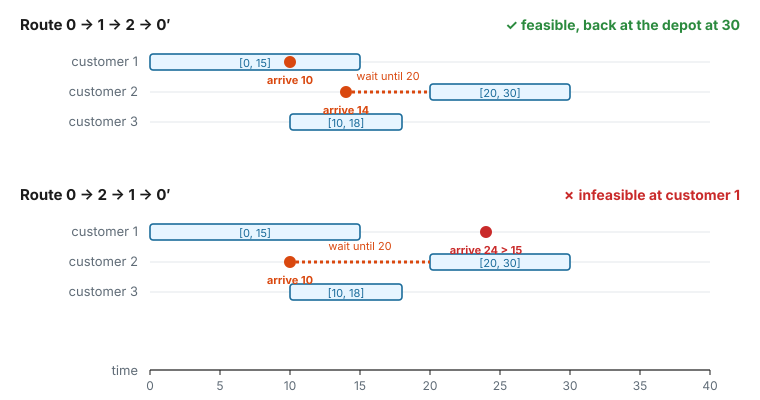
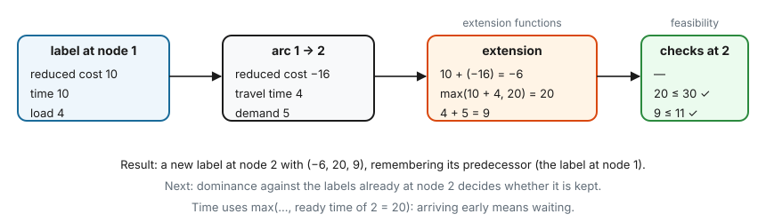
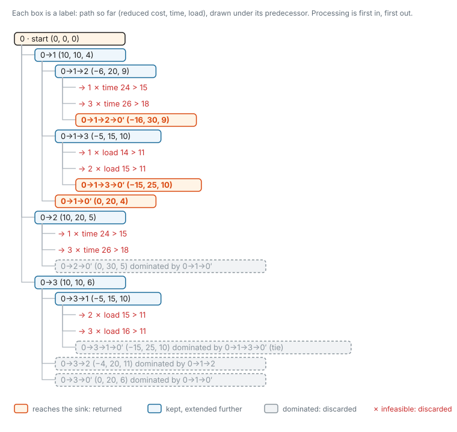

# 2. Resources and labels

[Page 1](master-and-pricing.md) ended with a problem. A shortest path algorithm keeps one "best distance" per
node, but in the RCSPP two paths that reach the same node can be in completely different situations. One may have
a full vehicle while the other is empty; one may arrive late while the other still has time. We need to remember
*what each path has accumulated so far*.

This page explains how `rcspp` does that:

- a **resource** is one quantity that a path accumulates (time, load, cost, visited customers…);
- a **label** is a partial path together with the current value of every resource;
- every resource is defined by **four functions**: extension, feasibility, cost and dominance;
- the solver grows labels arc by arc, discarding the ones that break a rule or are clearly worse than another.

At the end we run the whole search by hand on the small example, and compare it with what the solver returns.

---

## 2.1 The example, now with time windows

We keep the instance from page 1 (depot 0, customers 1–3, the same distances $d_{ij}$, demands $q = (4, 5, 6)$,
capacity $Q = 11$) and add one rule: each customer may only be visited during its **time window** $[a_i, b_i]$.

| node | time window $[a_i, b_i]$ | demand |
|---|---|---|
| depot 0 (start and end) | $[0, 100]$ | – |
| customer 1 | $[0, 15]$ | 4 |
| customer 2 | $[20, 30]$ | 5 |
| customer 3 | $[10, 18]$ | 6 |

- Driving from $i$ to $j$ takes $d_{ij}$ time units. To keep the numbers simple, serving a customer takes no time.
  (The repository's VRP example adds the service time at $i$ to the travel time of every arc leaving $i$.)
- Arriving **before** $a_j$ is allowed: the vehicle waits until $a_j$.
- Arriving **after** $b_j$ is not allowed.

Time windows make the **order** of visits matter, which capacity alone never did:



Going 1 then 2 works: we reach customer 2 early and wait. Going 2 then 1 fails: we must wait at customer 2 until
20, so we reach customer 1 at 24, after its window has closed at 15. The two routes visit the same customers and
drive the same distance, but only one of them is allowed.

---

## 2.2 Resources

A **resource** is a value that a path carries with it and updates on every arc. In the example there are three:

| resource | starts at | on arc $i \to j$ | must satisfy at node $j$ |
|---|---|---|---|
| **reduced cost** | 0 | add $\bar c_{ij}$ | nothing |
| **time** | 0 | $\max(t + d_{ij},\ a_j)$ | $t \le b_j$ |
| **load** | 0 | add $q_j$ | $\text{load} \le Q$ |

Other problems use other resources. For example: battery charge (decreases on each arc, must stay $\ge 0$); hours
worked in a crew duty; number of arcs used; the set of customers already visited. That last one is not a number, and
page 3 needs it.

Two pieces of data come from the graph:

- each **arc** stores its **consumption** for every resource (here: $\bar c_{ij}$, $d_{ij}$ and $q_j$);
- each **node** can have its own **limits** (here: the time window of $j$).

:::{note}
**The cost is a resource too.** In `rcspp`, the value being minimised is not something separate from the
resources: it is simply the first resource, and it is added up along the arcs like the load. We come back to why
in section 2.5.
:::

---

## 2.3 Labels

A **label** is one partial path from the source, summarised by:

- the node where it currently ends;
- the value of every resource at that point;
- a pointer to the label it was extended from (its **predecessor**).

We write a label as its path followed by its resource values *(reduced cost, time, load)*. For example,
`0→1  (10, 10, 4)` has driven from the depot to customer 1, has reduced cost 10 so far, and arrived at time 10
carrying 4 units.

The solver doesn't store the path itself. It follows the predecessor pointers backwards when a label reaches the
sink, which is how `solution.path_node_ids` is rebuilt.

Unlike Dijkstra, **one node can hold many labels**, one for each partial path that is still worth pursuing. That
solves the problem from page 1: arriving at customer 2 with load 5 and arriving with load 9 are two different labels.

---

## 2.4 The four functions of a resource

Each resource is defined by four functions, and each answers one question.

| function | question | when it is used |
|---|---|---|
| **extension** | Given this label's value and the arc's consumption, what is the new value? | every time a label crosses an arc |
| **feasibility** | Is this value allowed at this node? | right after each extension |
| **cost** | What does this value contribute to the objective? | to rank and return solutions |
| **dominance** | Is this value at least as good as that one? | to compare labels at the same node |

Here is one extension step from the example: the label `0→1  (10, 10, 4)` crosses arc $1 \to 2$.



### Extension

The extension function computes the new value from the current value and the arc's consumption.

- Load and reduced cost use **addition**: new = current + consumption.
- Time uses the **time-window extension**: new = $\max(\text{current} + \text{travel},\ a_j)$. The $\max$ is the
  waiting: arriving at 14 when customer 2 opens at 20 means the path continues from 20.

Waiting is a good example of why resources are more general than "sum of arc weights". A path's arrival time is
*not* the sum of its travel times. This is also why each resource gets its own extension function.

### Feasibility

The feasibility function says whether the new value is allowed **at the node the label has just reached**.

- Time: $t \le b_j$, the closing time of that node.
- Load: $0 \le \text{load} \le 11$, the same limits everywhere.
- Reduced cost: always allowed.

A label that fails is thrown away immediately. That is always safe: the path already breaks a rule, and no
continuation can undo that.

### Cost

The cost function turns a resource value into a number to minimise. For the cost resource it is the value itself
(`ValueCostFunction`). For the other resources it is 0 (`TrivialCostFunction`).

:::{important}
`ResourceGraph` only looks at the cost function of its **cost resource** (the first resource). The cost functions
of all other resources are ignored. Giving time a `ValueCostFunction` would *not* make the solver minimise
"reduced cost + time". Use `TrivialCostFunction` on the other resources so the intent is clear.
:::

### Dominance

The dominance function compares two values of the same resource at the same node, and answers "is the first at
least as good as the second?". For all three resources in the example, lower is better (`ValueDominanceFunction`,
meaning $\le$):

- lower reduced cost: cheaper so far;
- lower time: earlier, so more customers can still be reached (you can always wait);
- lower load: more room left in the vehicle.

A label **dominates** another at the same node if it is at least as good on **every** resource. The dominated one
is discarded, because anything it could still do, the other can do at least as well. Page 3 explains why this is
correct, and when it isn't.

### The "trivial" functions

Each function has a trivial version, which makes a resource neutral for that question:

| trivial function | behaviour | effect |
|---|---|---|
| `TrivialExtensionFunction` | leaves the value unchanged (at its starting value) | the resource never changes |
| `TrivialFeasibilityFunction` | always `true` | the resource never makes a label infeasible |
| `TrivialCostFunction` | always `0` | the resource adds nothing to the objective |
| `TrivialDominanceFunction` | always `true` | the resource is **ignored** when comparing labels |

The last one surprises people. Dominance needs *every* resource to agree, so "always true" means "this resource
never prevents dominance". It does **not** mean "never dominates, keep every label". Put it on every resource, and
the first label reaching a node dominates all the later ones.

---

## 2.5 Why the cost is a resource

Treating the objective as "just another resource" keeps the design simple, and it has real benefits:

- **One mechanism for everything.** The cost is extended, compared and checked exactly like the other resources.
  The algorithms don't need a special case.
- **Reduced costs slot in naturally.** `update_reduced_costs(duals)` computes $\bar c_{ij} = c_{ij} - \sum$
  coefficient $\cdot\, \pi$ for every arc (page 1) and writes it into the **cost resource's consumption on that
  arc**. The base cost `arc.cost` is never overwritten, which is how the true cost of a path can still be computed
  afterwards.
- **Costs don't have to be sums.** Because the cost has its own extension function, you can model a cost that
  depends on the state of the path, for example a penalty that grows with waiting time. That just means a different
  extension function.

In the Python API this is why **the first resource you register must be a `real` resource: it becomes the cost**.

---

## 2.6 Running the search by hand

We now solve the pricing problem of page 1's first iteration (all duals $\pi_i = 20$), this time with time windows.
The reduced arc costs are the same as on page 1:

| arcs | reduced cost $\bar c_{ij}$ |
|---|---|
| $0 \to j$ | 10 |
| $1 \leftrightarrow 2$ | $4 - 20 = -16$ |
| $1 \leftrightarrow 3$ | $5 - 20 = -15$ |
| $2 \leftrightarrow 3$ | $6 - 20 = -14$ |
| $i \to 0'$ | $10 - 20 = -10$ |

The solver's default algorithm keeps a **queue** of labels to process, first in, first out:

1. Put the starting label `0  (0, 0, 0)` at the source in the queue.
2. Take the next label from the queue. If it is at the sink, keep it as a candidate solution. Otherwise, **extend**
   it along every outgoing arc.
3. For each new label: if it is **infeasible**, discard it. If a label already at that node **dominates** it,
   discard it. Otherwise keep it (removing any existing labels it dominates), and add it to the queue.
4. Repeat until the queue is empty. Return the labels left at the sink, cheapest first.

Here is every label the search creates. Each is drawn under the label it was extended from:



Let's walk through the interesting moments.

**Paths with one arc.** From the depot we reach every customer: `0→1 (10, 10, 4)`, `0→2 (10, 20, 5)` (arrived at 10,
waited until 20) and `0→3 (10, 10, 6)`.

**Time windows at work.** From `0→2` both continuations fail: customer 1 would be reached at $20 + 4 = 24 > 15$, and
customer 3 at $20 + 6 = 26 > 18$. Customer 2 opens so late that nothing can follow it except the return to the depot.

**Capacity at work.** From `0→1→3` (load 10) no customer fits any more: going to 1 again would make 14, going to 2
would make 15. Capacity also stops the negative cycle $1 \to 2 \to 1$ from page 1: `0→1→2→1` is rejected (here time
already rules it out too).

**Dominance at a customer.** When `0→3→2  (−4, 20, 11)` is created, node 2 already holds `0→1→2  (−6, 20, 9)`.
That one is cheaper ($-6 \le -4$), no later ($20 \le 20$, both waited until 20) and lighter ($9 \le 11$). So
`0→3→2` is discarded before it is ever extended. Anything it could do from node 2, `0→1→2` can do at least as well.

**Dominance at the sink.** `0→1→0′ (0, 20, 4)` dominates `0→2→0′ (0, 30, 5)` and `0→3→0′ (0, 20, 6)`.
`0→3→1→0′` is an exact tie with `0→1→3→0′`, so the one found first is kept.

**Result.** Three labels are left at the sink:

| route | reduced cost | returned with `upper_bound=-1e-9`? |
|---|---|---|
| 0 → 1 → 2 → 0′ | **−16** | yes |
| 0 → 1 → 3 → 0′ | **−15** | yes |
| 0 → 1 → 0′ | 0 | no (not negative) |

The library's solver, run on this exact graph, returns the same three labels and, with `upper_bound=-1e-9`, the two
negative ones.

### What to notice

- **Counts.** The search created 13 feasible labels (plus the start), rejected 8 extensions as infeasible, and
  discarded 4 labels by dominance. Without dominance, 7 labels would reach the sink instead of 3. On real instances
  the difference is many orders of magnitude, which is why dominance matters so much.
- **Dominance compares everything, even at the sink.** At the sink only the cost really matters, but the labels are
  still compared on time and load too. That is harmless (it only keeps a few extra labels), but it is worth knowing.
- **A warning sign.** `0→3→2` was discarded in favour of `0→1→2`, although they visited *different* customers. That
  was fine here, because repeated visits are allowed and time and load already describe everything that matters.
  If routes must visit each customer at most once, it would not be fine: `0→3→2` could still visit customer 1, and
  `0→1→2` could not. Page 3 covers this.

---

## 2.7 Resource types

Every resource has a **type**, which is the kind of value it holds:

| Python name | C++ type | value | typical use |
|---|---|---|---|
| `real` | `RealResource` | `double` | cost, time, distance, load |
| `int` | `IntResource` | `int` | load, number of stops |
| `real_set` / `int_set` | `SetResource<…>` | a set of numbers | visited customers |
| `bitset` | `BitsetResource` | a compact set of node ids | visited customers, faster |

Number resources work with the functions above. Set resources have their own: union or intersection for extension,
size limits for feasibility, and inclusion for dominance (visited $\subseteq$ visited). They are the tool for "visit
each customer at most once", and page 3 uses them. The [concepts page](../cpp/concepts.md) lists every built-in
function.

---

## 2.8 In code

### Python

This builds exactly the pricing graph of section 2.6. It follows the same pattern as
[`examples/python/vrp/vrp.py`](https://github.com/lab-core/rcspp/blob/main/examples/python/vrp/vrp.py).

```python
from rcspp.graph import ResourceGraph, Row
from rcspp.resource import (
    AdditionExtensionFunction, MinMaxFeasibilityFunction,
    TimeWindowExtensionFunction, TimeWindowFeasibilityFunction,
    TrivialCostFunction, TrivialFeasibilityFunction,
    ValueCostFunction, ValueDominanceFunction,
)

D = {(0, 1): 10, (0, 2): 10, (0, 3): 10, (1, 2): 4, (1, 3): 5, (2, 3): 6}
def dist(i, j):
    return D[(min(i, j), max(i, j))]

SINK = 4                                  # copy of the depot where routes end
demand = {1: 4, 2: 5, 3: 6}
time_windows = {0: (0.0, 100.0), 1: (0.0, 15.0), 2: (20.0, 30.0), 3: (10.0, 18.0), SINK: (0.0, 100.0)}

rg = ResourceGraph()
# Resource 0 (the first real resource): the cost, minimised by the solver
rg.add_real_resource(AdditionExtensionFunction(), TrivialFeasibilityFunction(),
                     ValueCostFunction(), ValueDominanceFunction())
# Resource 1: time, with waiting and deadlines
rg.add_real_resource(TimeWindowExtensionFunction(time_windows), TimeWindowFeasibilityFunction(time_windows),
                     TrivialCostFunction(), ValueDominanceFunction())
# Resource 2: load, at most 11
rg.add_real_resource(AdditionExtensionFunction(), MinMaxFeasibilityFunction(0.0, 11.0),
                     TrivialCostFunction(), ValueDominanceFunction())

rg.add_node(0, source=True)
for i in (1, 2, 3):
    rg.add_node(i)
rg.add_node(SINK, sink=True)

for i in (0, 1, 2, 3):
    for j in (1, 2, 3, SINK):
        if i == j or (i == 0 and j == SINK):
            continue
        d = dist(i, 0 if j == SINK else j)
        rg.add_arc(
            (d, d, demand.get(j, 0)),     # consumption: (cost, time, load), in registration order
            i, j,
            cost=d,                       # base cost, kept for computing the real route cost
            rows=[] if i == 0 else [Row(i, 1.0)],   # arcs leaving customer i carry its dual
        )

rg.update_reduced_costs({1: 20.0, 2: 20.0, 3: 20.0})   # the duals of iteration 0
result = rg.solve(upper_bound=-1e-9)
for sol in result.solutions:
    print(sol.cost, sol.path_node_ids)
# -16.0 [0, 1, 2, 4]
# -15.0 [0, 1, 3, 4]
```

The rules to remember:

- **The first registered resource must be `real`; it is the cost.** `update_reduced_costs` writes into it.
- **The consumption tuple of `add_arc` has one entry per registered resource, in registration order.** (Internally
  the resources are regrouped by type, but you never have to think about that.)
- **Node-specific limits are given as dictionaries keyed by node id**, such as `time_windows` above. A node without
  an entry gets no limit (for time windows: no waiting and no deadline).
- Register all resources before adding nodes and arcs.

### C++

The same structure, with the resource types as template parameters:

```cpp
using R = RealResource;
ResourceGraph<R> graph;                  // three resources, all of type RealResource
graph.add_resource<R>(std::make_unique<AdditionExtensionFunction<R>>(),
                      std::make_unique<TrivialFeasibilityFunction<R>>(),
                      std::make_unique<ValueCostFunction<R>>(),
                      std::make_unique<ValueDominanceFunction<R>>());          // 0: cost
graph.add_resource<R>(std::make_unique<TimeWindowExtensionFunction<R>>(time_windows),
                      std::make_unique<TimeWindowFeasibilityFunction<R>>(time_windows),
                      std::make_unique<TrivialCostFunction<R>>(),
                      std::make_unique<ValueDominanceFunction<R>>());          // 1: time
graph.add_resource<R>(std::make_unique<AdditionExtensionFunction<R>>(),
                      std::make_unique<MinMaxFeasibilityFunction<R>>(0.0, 11.0),
                      std::make_unique<TrivialCostFunction<R>>(),
                      std::make_unique<ValueDominanceFunction<R>>());          // 2: load

// consumption of one arc: one {value} per resource of type R, in registration order
using Consumption = std::tuple<std::vector<std::tuple<double>>>;
graph.add_arc(Consumption{{{rc}, {travel_time}, {demand}}}, i, j, base_cost, rows);
```

### Under the hood: how a function knows about "its" node

A `TimeWindowFeasibilityFunction` receives the whole time-window table, but it checks a label against *one* closing
time. How does it know which? The library makes a specialised copy of each function for every place it is used:

- **Extension functions are copied once per arc.** Each copy is told the arc's origin and destination (the
  `preprocess(origin_id, destination_id)` hook), and stores what it needs. The time-window extension on arc
  $1 \to 2$ stores $a_2 = 20$.
- **Feasibility, cost and dominance functions are copied once per node.** Each copy is told its node (the
  `preprocess(node_id)` hook). The time-window feasibility at node 2 stores $b_2 = 30$.
- A label's resources always use the copies belonging to the node where it ends. When a label is recycled for a
  different node, its functions are reset from that node.

This matters as soon as you write your own resource: anything that depends on "where we are" should be read in
`preprocess`, not looked up on every call. See
[`extension_function.hpp`](https://github.com/lab-core/rcspp/blob/main/cpp/rcspp/resource/functions/extension/extension_function.hpp)
and [`feasibility_function.hpp`](https://github.com/lab-core/rcspp/blob/main/cpp/rcspp/resource/functions/feasibility/feasibility_function.hpp).

---

## Check yourself

1. Why is `0→1→2` feasible but `0→2→1` not, although both visit the same customers?
2. `0→1→2` and `0→3→2` both have time 20 at node 2, even though they drove different distances ($10 + 4 = 14$ and
   $10 + 6 = 16$). Why?
3. The route duration is limited to 25 by changing the sink's time window to $[0, 25]$. Which of the three
   returned routes survive, and what is the best reduced cost now?
4. You register the load resource with `TrivialDominanceFunction` instead of `ValueDominanceFunction`. What changes
   in how labels are compared, and why can this make pricing miss good routes on other instances?
5. Why would giving the time resource a `ValueCostFunction` not add travel time to the objective?

### Answers

1. `0→1→2` reaches customer 1 at 10 (window $[0, 15]$) and customer 2 at 14, then waits until 20 (window $[20, 30]$).
   `0→2→1` must wait at customer 2 until 20, so it reaches customer 1 at 24, after 15.
2. Both reach customer 2 before it opens at 20, and waiting erases the difference. That is exactly the
   $\max(\ldots, a_j)$ in the time-window extension.
3. `0→1→2→0′` returns at 30 > 25 and becomes infeasible. `0→1→3→0′` (back at 25) and `0→1→0′` (back at 20) survive.
   The best reduced cost is now **−15**.
4. Load is then ignored during dominance: a label can be discarded because another one is cheaper and earlier, even
   if the other is much heavier. Here that happens to lose nothing. In general, the lighter label might have been
   the only one with room for another customer, so the best route can be missed and pricing is no longer exact.
   The trivial dominance function is only safe for a resource that has no influence on what a path can still do.
5. `ResourceGraph` only uses the cost function of its first resource (the cost resource). The cost functions of the
   other resources are ignored.
